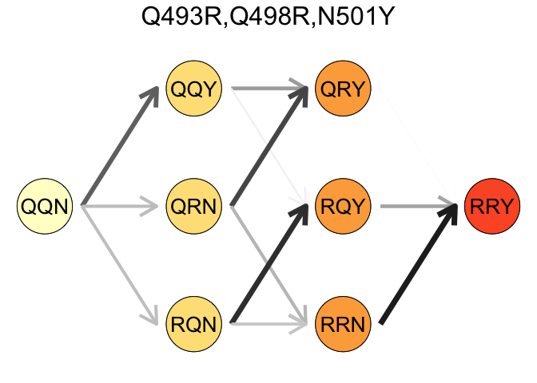

Omicron_ACE2_Landscape
================
Alief Moulana
4/27/2022

## Load the Data

Before running any chunk to generate figures, load all required
datasets. This is to ensure you have downloaded all the datasets in the
`data` category.

``` r
###Mutation Dictionary###
n <- 1:15 #initialize 15 mutations
nn <- c(339, 371, 373, 375, 417, 440, 446, 477, 478, 484, 493, 496, 498, 501, 505) #initialize the correct numbering for the mutations
nn.muts <- c("G339D","S371L","S373P","S375F","K417N","N440K","G446S","S477N","T478K","E484A","Q493R","G496S","Q498R","N501Y","Y505H")

###KD Data###
#initialize, get Kd data
Kds <- read.table(file = 'data/cleaned_Kds_RBD_ACE2_withx.tsv', sep = '\t', 
                  header = TRUE, 
                  colClasses=c("character",rep("numeric",45))
                  )
Kds_simplified <- data.frame(Genotype=Kds$geno,Log10Kd = Kds$log10Kd_pinned, Error = Kds$err_log10Kd) #drop most of the columns

###Epistasis Data###
epistasis.biochem <- read.delim("data/ACE2_5order_biochem.txt" ,skip = 2,header = TRUE, sep = "\t", dec = ".") #includes x now
epistasis.stat <- read.delim("data/ACE2_5order_stat.txt",skip = 2,header = TRUE, sep = "\t", dec = ".")
epistasis.biochem$Order <- ifelse(epistasis.biochem$Term == "Intercept",0,str_count(epistasis.biochem$Term, pattern = ",")+1)
epistasis.stat$Order <- ifelse(epistasis.stat$Term == "Intercept",0,str_count(epistasis.stat$Term, pattern = ",")+1)
epistasis.biochem <- separate(data = epistasis.biochem, col = Term, into = c("Term 1", "Term 2", "Term 3", "Term 4","Term 5"), sep = ",")
```

    ## Warning: Expected 5 pieces. Missing pieces filled with `NA` in 1941 rows [1, 2,
    ## 3, 4, 5, 6, 7, 8, 9, 10, 11, 12, 13, 14, 15, 16, 17, 18, 19, 20, ...].

``` r
epistasis.biochem[,1:5] <- apply(epistasis.biochem[,1:5],2,mapvalues,from=n,to=nn.muts)
```

    ## The following `from` values were not present in `x`: 1

    ## The following `from` values were not present in `x`: 1, 2

    ## The following `from` values were not present in `x`: 1, 2, 3

    ## The following `from` values were not present in `x`: 1, 2, 3, 4

``` r
epistasis.biochem[,1:5]<- lapply(epistasis.biochem[,1:5], function(X){ordered(X,levels = nn.muts,labels=nn.muts)})
epistasis.stat <- separate(data = epistasis.stat, col = Term, into = c("Term 1", "Term 2", "Term 3", "Term 4","Term 5"), sep = ",")
```

    ## Warning: Expected 5 pieces. Missing pieces filled with `NA` in 1941 rows [1, 2,
    ## 3, 4, 5, 6, 7, 8, 9, 10, 11, 12, 13, 14, 15, 16, 17, 18, 19, 20, ...].

``` r
epistasis.stat[,1:4] <- apply(epistasis.stat[,1:4],2,mapvalues,from=n,to=nn.muts)
```

    ## The following `from` values were not present in `x`: 1

    ## The following `from` values were not present in `x`: 1, 2

    ## The following `from` values were not present in `x`: 1, 2, 3

``` r
epistasis.stat[,1:4]<- lapply(epistasis.stat[,1:4], function(X){ordered(X,levels = nn.muts,labels=nn.muts)})

###Structure Data for Epistasis###
first.structure <- read.delim("data/firstorder_structure_summaryACE2.csv" ,header = TRUE, sep = ",", dec = ".")
second.structure <- read.delim("data/2ndorder_structure_summaryACE2.csv" ,header = TRUE, sep = ",", dec = ".")

###Data for Delta Delta Delta G###
delta.G.vs.immune <- read.delim("data/deltadeltadeltag.csv" ,header = TRUE, sep = ",", dec = ".")

###Probability Data###
probability <- read.delim("data/proba_order_mut_above_wuhan.csv" ,header = TRUE, sep = ",", dec = ".")
strong.probability <- read.delim("data/proba_order_strong_selection_noBA2.csv" ,header = TRUE, sep = ",", dec = ".")
three.way <- read.delim("data/probability_three_mutations.csv" ,header = TRUE, sep = ",", dec = ".")
gisaid.mean <-read.delim("data/gisaid_fig1_data.csv" ,header = TRUE, sep = ",", dec = ".")
gisaid.N501Y <-read.delim("data/gisaid_fig2_data.csv" ,header = TRUE, sep = ",", dec = ".")
```

## Figure 1

### Processing Kd Data.

``` r
Kds_simplified[paste0('Mutation ', nn)] <- purrr::map_dfc(n, 
                                                     ~case_when(substr(Kds_simplified$Genotype,.x,.x) == '0' ~ '0',
                                                                substr(Kds_simplified$Genotype,.x,.x) == '1' ~ '1'
                                                     )
) #create columns that correspond to the allele for each mutation
```

    ## New names:
    ## • `` -> `...1`
    ## • `` -> `...2`
    ## • `` -> `...3`
    ## • `` -> `...4`
    ## • `` -> `...5`
    ## • `` -> `...6`
    ## • `` -> `...7`
    ## • `` -> `...8`
    ## • `` -> `...9`
    ## • `` -> `...10`
    ## • `` -> `...11`
    ## • `` -> `...12`
    ## • `` -> `...13`
    ## • `` -> `...14`
    ## • `` -> `...15`

``` r
Kds_simplified[paste0('Mutation ', nn)] <- lapply(Kds_simplified[paste0('Mutation ', nn)], factor) #factorize (object type) the mutations
wuhan.Kd <- Kds_simplified[Kds_simplified$Genotype==
                             paste(replicate(length(n), "0"), collapse = ""),"Log10Kd"]
omicron.Kd <- Kds_simplified[Kds_simplified$Genotype==
                             paste(replicate(length(n), "1"), collapse = ""),"Log10Kd"]

Kds_simplified$Class <- str_count(Kds_simplified$Genotype,"1") #initialize variable "Class", which is #hamming distance from Wuhan
Kds_simplified$Class <- ordered(Kds_simplified$Class, levels = as.character(0:15)) #order em

#getsomepalettes
getYellowtoRed <- colorRampPalette(c('#ffffcc','#ffeda0','#fed976','#feb24c','#fd8d3c','#fc4e2a','#e31a1c','#bd0026','#800026'))
getPalettePairedLong = colorRampPalette(c('#121212','#808080','#a6cee3','#1f78b4','#b2df8a','#33a02c','#fb9a99','#e31a1c','#fdbf6f','#ff7f00','#cab2d6','#6a3d9a','#ffff99','#b15928','#4f1530'))

binarypermutations <- function(n, vals = 0:1){
  tmp <- rep(list(vals), n)
  var <- do.call(expand.grid, tmp)
  return(apply(var, 1, paste0, collapse=''))
} #create a function that generates all possible 15-tuple permutations between 0 and 1

insertstr <- function(x,y,when){
  a <- x[1]
  b <- y
  return(paste(substr(a,1,when-1),b,substr(a,when,nchar(a)),sep=""))
} #create a function that inserts some character or string into another string in the first column of a dataframe at a specific position
Kds_mutational_effects <- data.frame(Genotype = binarypermutations(14)) #create a dataframe
Kds_mutational_effects[paste0('Mutation ',nn,"_0")] <- purrr::map_dfc(n, 
                                                          ~with(Kds_simplified, Log10Kd[match(
                                                            apply(Kds_mutational_effects,1,insertstr,when=.x,y="0"), Genotype)])
                                                        )  #create a variable of Kd values where at a specific locus, the allele = 0
```

    ## New names:
    ## • `` -> `...1`
    ## • `` -> `...2`
    ## • `` -> `...3`
    ## • `` -> `...4`
    ## • `` -> `...5`
    ## • `` -> `...6`
    ## • `` -> `...7`
    ## • `` -> `...8`
    ## • `` -> `...9`
    ## • `` -> `...10`
    ## • `` -> `...11`
    ## • `` -> `...12`
    ## • `` -> `...13`
    ## • `` -> `...14`
    ## • `` -> `...15`

``` r
Kds_mutational_effects[paste0('Mutation ',nn,"_1")] <- purrr::map_dfc(n, 
                                                          ~with(Kds_simplified, Log10Kd[match(
                                                            apply(Kds_mutational_effects,1,insertstr,when=.x,y="1"), Genotype)])
                                                        ) #create a variable of Kd values where at a specific locus, the allele = 1
```

    ## New names:
    ## • `` -> `...1`
    ## • `` -> `...2`
    ## • `` -> `...3`
    ## • `` -> `...4`
    ## • `` -> `...5`
    ## • `` -> `...6`
    ## • `` -> `...7`
    ## • `` -> `...8`
    ## • `` -> `...9`
    ## • `` -> `...10`
    ## • `` -> `...11`
    ## • `` -> `...12`
    ## • `` -> `...13`
    ## • `` -> `...14`
    ## • `` -> `...15`

``` r
Kds_mutational_effects[paste0('Effect_ ',nn)] <- purrr::map_dfc(nn, 
                                                          ~Kds_mutational_effects[paste0('Mutation ',.x,"_1")]-
                                                            Kds_mutational_effects[paste0('Mutation ',.x,"_0")])
Kds_mutational_effects[paste0('Effect_error_',nn)] <- purrr::map_dfc(n, 
                                                          ~sqrt(
                                                            (with(Kds, err_log10Kd[match(
                                                            apply(Kds_mutational_effects,1,insertstr,when=.x,y="1"), geno)]))^2+
                                                            (with(Kds, err_log10Kd[match(
                                                            apply(Kds_mutational_effects,1,insertstr,when=.x,y="0"), geno)]))^2
                                                          )
                                                        )
```

    ## New names:
    ## • `` -> `...1`
    ## • `` -> `...2`
    ## • `` -> `...3`
    ## • `` -> `...4`
    ## • `` -> `...5`
    ## • `` -> `...6`
    ## • `` -> `...7`
    ## • `` -> `...8`
    ## • `` -> `...9`
    ## • `` -> `...10`
    ## • `` -> `...11`
    ## • `` -> `...12`
    ## • `` -> `...13`
    ## • `` -> `...14`
    ## • `` -> `...15`

``` r
#create a set of variables for the difference (mutational effects) and its errors
Kds_mutational_effects.long <- reshape(Kds_mutational_effects, direction="long", 
        varying=list(paste0('Mutation ',nn,"_0"), paste0('Mutation ',nn,"_1"), paste0('Effect_ ',nn),paste0('Effect_error_',nn)), 
        v.names=c("KD WT","KD OM","KD Effect","Effect Error")) #make the dataframe long. It's not possible to do it above, because of matrix optim
Kds_mutational_effects.long$Mutation <- as.factor(Kds_mutational_effects.long$time) #create a new variable called mutation, denoting mutational identity we consider in each effect
levels(Kds_mutational_effects.long$Mutation) <- nn.muts #renaming the levels of the factor
data_summary <- function(x) {
   m <- mean(x)
   ymin <- m-sd(x)
   ymax <- m+sd(x)
   return(c(y=m,ymin=ymin,ymax=ymax))
}
```

\###All Figure 1

``` r
###Plot FIGURE 1A###
ggplot(Kds_simplified, aes(x=Log10Kd))+
  geom_histogram( position="identity",bins=40,  size = 0,alpha=1,fill="#333333")+
  labs(x=expression(-log~italic(K)[paste("D", ",", "app")])) +
  ylab("Number of Genotypes") +
  theme_classic()+
  geom_vline(aes(xintercept = wuhan.Kd), colour = brewer.pal(n = 8, name = "Set1")[2],size=1.5)+
  geom_vline(aes(xintercept = omicron.Kd), colour = brewer.pal(n = 8, name = "Set1")[1],size=1.5)+
  theme(axis.text.x = element_text(angle = 0,colour="black"),
        axis.text.y = element_text(colour="black"),
        axis.text=element_text(size=12),
        legend.text=element_text(size=12),
        legend.title=element_blank(),
        axis.title=element_text(size=14),
        panel.grid.minor.x = element_blank(),
        legend.position = "none")
```

<!-- -->

``` r
ggsave("figures/Figure1_histogram_distribution_of_Kds_0517edit.png", width = 3, height = 3, units = "in")

###Plot FIGURE 1B###
ggplot(Kds_simplified, aes(x=Class, y = Log10Kd))+
  #geom_violin() +
  geom_jitter(height = 0.05, width = 0.3, size=0.8,alpha = 0.4, aes(color=Class, fill = Class))+
  #geom_violin(width=1.4) +
  geom_boxplot(width=0.7, color="#484848",alpha=0.4, outlier.alpha = 0.0,size=0.5) +
  scale_color_manual(values = getYellowtoRed(16))+
  scale_fill_manual(values = getYellowtoRed(16))+
  #geom_density(alpha=.2, fill="#FF6666") +
  ylim(6,10)+
  xlab("Number of Mutations") +
  labs(y=expression(-log~italic(K)[paste("D", ",", "app")])) +
  theme_classic()+
  theme(axis.text.x = element_text(angle = 0,colour="black"),
        axis.text.y = element_text(colour="black"),
        axis.text=element_text(size=12),
        legend.text=element_text(size=12),
        legend.title=element_blank(),
        axis.title=element_text(size=14),
        legend.position = "none")+
  geom_hline(yintercept = wuhan.Kd , colour = "black", linetype = "dashed")
```

    ## Warning: Removed 5 rows containing non-finite values (stat_boxplot).

    ## Warning: Removed 7 rows containing missing values (geom_point).

<!-- -->

``` r
ggsave("figures/Figure1_boxplot_and_jitters_Kds_across_numb_mutations_0517edit.png", width = 4.5, height = 3, units = "in")
```

    ## Warning: Removed 5 rows containing non-finite values (stat_boxplot).

    ## Warning: Removed 6 rows containing missing values (geom_point).

``` r
###Plot FIGURE 1C###
ggplot(Kds_mutational_effects.long, aes(x=Mutation, y = `KD Effect`))+
  #geom_jitter(height = 0.2, width = 0.2, size=0.1,alpha = 0.1, color="#b9b9b9",aes( fill = Mutation))+
  geom_violin(width=1, aes(fill=Mutation), color ="#333333",alpha = 0.75, size =0.25) +
  stat_summary(fun.data=data_summary,geom="pointrange", size=0.25,color="black")+
  #geom_boxplot(width=0.15, color="#333333", alpha = 0.5) +
  geom_point(data=Kds_mutational_effects.long[Kds_mutational_effects.long$Genotype==strrep('0',14),],
             aes(x=Mutation, y = `KD Effect`),position = position_nudge(x = -0.15),size=1.5,
             colour = brewer.pal(n = 8, name = "Set1")[2])+ #also distinctively color the point that corresponds to wuhan background
  geom_errorbar(data=Kds_mutational_effects.long[Kds_mutational_effects.long$Genotype==strrep('0',14),],
                aes(ymin=`KD Effect`-`Effect Error`, ymax=`KD Effect`+`Effect Error`), width=.01,
                position = position_nudge(x = -0.15),colour = brewer.pal(n = 8, name = "Set1")[2])+
  geom_point(data=Kds_mutational_effects.long[Kds_mutational_effects.long$Genotype==strrep('1',14),],
             aes(x=Mutation, y = `KD Effect`),position = position_nudge(x = 0.15),size=1.5,
             colour = brewer.pal(n = 8, name = "Set1")[1])+ #also distinctively color the point that corresponds to om background
  geom_errorbar(data=Kds_mutational_effects.long[Kds_mutational_effects.long$Genotype==strrep('1',14),],
                aes(ymin=`KD Effect`-`Effect Error`, ymax=`KD Effect`+`Effect Error`), width=.01,
                position = position_nudge(x = 0.15),colour = brewer.pal(n = 8, name = "Set1")[1])+
  scale_color_manual(values = getPalettePairedLong(15))+
  scale_fill_manual(values = getPalettePairedLong(15))+
  scale_x_discrete(expand=c(0,0))+
  ylim(-1.5,2.5)+
  xlab("Mutation") +
  labs(y=expression(Delta~(-log~italic(K)[paste("D", ",", "app")]))) +
  geom_point(data=Kds_mutational_effects.long[Kds_mutational_effects.long$Genotype==strrep('1',14),],
             aes(x=Mutation, y = `KD Effect`),position = position_nudge(x = 0.15),size=1.5,
             colour = brewer.pal(n = 8, name = "Set1")[1])+
  theme_classic()+
  theme(axis.text.x = element_text(size=11,angle = 90,hjust = 1, vjust = 0.5),
        axis.text.y = element_text(size=12),
        axis.text=element_text(color="black"),
        legend.text=element_text(size=12),
        legend.title=element_blank(),
        axis.title=element_text(size=14),
        legend.position = "none")+
  geom_hline(yintercept = 0 , colour = "black", linetype = "dashed")
```

    ## Warning: Removed 6 rows containing non-finite values (stat_ydensity).

    ## Warning: Removed 6 rows containing non-finite values (stat_summary).

<!-- -->

``` r
ggsave("figures/Figure1_violin_and_jitters_Kd_effect_per_mutation_withoutanythingelse_trimmed_0517edit.png", width = 7.5, height = 3, units = "in")
```

    ## Warning: Removed 6 rows containing non-finite values (stat_ydensity).
    ## Removed 6 rows containing non-finite values (stat_summary).

## Figure 2

### Figure 2: Epistasis

``` r
###Plot FIGURE 2A###
#just good ol linear effects
ggplot(subset(epistasis.biochem,Order=="1"), aes(x=`Term 1`, y=Coefficient, fill = `Term 1`))+
  geom_bar(stat='identity',color="#333333")+
  geom_errorbar(aes(ymin=Coefficient-Standard.Error, ymax=Coefficient+Standard.Error), width=.6,
                position=position_dodge(.9), colour = "#969696",size=0.7) +
  scale_fill_manual(values = getPalettePairedLong(15))+
  xlab("Mutation") +
  ylab("Linear Effect") +
  theme_classic()+
  theme(axis.text.x = element_text(angle = 90,hjust = 1, vjust = 0.5),
        axis.text=element_text(size=12,color="black"),
        legend.text=element_text(size=12),
        legend.title=element_blank(),
        axis.title=element_text(size=14),
        legend.position = "none")
```

<!-- -->

``` r
ggsave("figures/Figure2_bars_linear_effects_0504edit.png", width = 4.5, height = 3.5, units = "in")

###Plot FIGURE 2B###
#bunch of rearranging the terms and coefficients
summing_coefficient <- function(x,y){
  return(with(y, sum(Coefficient[
    rowSums(x[1] == y,na.rm=TRUE) > 0  &
      rowSums(x[2] == y,na.rm=TRUE) > 0])
  ))
}

summing_coefficient <- function(x,y){
  return(with(y, sum(Coefficient[
    rowSums(x[1] == y,na.rm=TRUE) > 0  &
      rowSums(x[2] == y,na.rm=TRUE) > 0])
  ))
}
abs_summing_coefficient <- function(x,y){
  return(with(y, sum(abs(Coefficient[
    rowSums(x[1] == y,na.rm=TRUE) > 0  &
      rowSums(x[2] == y,na.rm=TRUE) > 0]))
  ))
}

summing_coefficient_to_one <- function(x,y){
  return(with(y, sum(Coefficient[
    rowSums(x[1] == y,na.rm=TRUE) > 0 ])
  ))
}

summing_coefficient_to_one_abs <- function(x,y){
  return(with(y, sum(abs(Coefficient[
    rowSums(x[1] == y,na.rm=TRUE) > 0 ]))
  ))
}

is.it.significant.at.higher <- function(x,y){
  return(with(y, sum(abs(one[
    rowSums(x[1] == y,na.rm=TRUE) > 0 & p.value < 0.05 ]))
  ))
}

epistasis.biochem.higher <- subset(epistasis.biochem,Order %in% c("3","4","5"))
epistasis.biochem.higher$one <- 1
epistasis.biochem.temp <- subset(epistasis.biochem,Order=="2")
epistasis.biochem.temp$t1 <- epistasis.biochem.temp$`Term 2`
epistasis.biochem.temp$t2 <- epistasis.biochem.temp$`Term 1`
epistasis.biochem.temp$part <- "A"
epistasis.biochem.temp$second <- "Pairwise"


epistasis.biochem.temp2 <- epistasis.biochem.temp
epistasis.biochem.temp2$`Term 1` <- epistasis.biochem.temp2$t1
epistasis.biochem.temp2$`Term 2` <- epistasis.biochem.temp2$t2
#epistasis.biochem.temp2$`Coefficient`<- apply(epistasis.biochem.temp2,1,summing_coefficient,y=epistasis.biochem.higher)
epistasis.biochem.temp2$part <- "B"
epistasis.biochem.temp2$second <- "Pairwise"

epistasis.biochem.temp3 <- subset(epistasis.biochem,Order=="1")
epistasis.biochem.temp3$`Term 2` <- epistasis.biochem.temp3$`Term 1`
epistasis.biochem.temp3$t1 <- NA
epistasis.biochem.temp3$t2 <- NA
epistasis.biochem.temp3$Coefficient <- NA
epistasis.biochem.temp3$part <- "C"
epistasis.biochem.temp3$second <- "Pairwise"

epistasis.biochem.temp4 <- subset(epistasis.biochem,Order=="1")
epistasis.biochem.temp4$`Term 2` <- "Higher"
epistasis.biochem.temp4$t1 <- NA
epistasis.biochem.temp4$t2 <- NA
#epistasis.biochem.temp4$Coefficient <- apply(epistasis.biochem.temp4,1,summing_coefficient_to_one,y=epistasis.biochem.higher)# net
epistasis.biochem.temp4$Coefficient <- apply(epistasis.biochem.temp4,1,summing_coefficient_to_one,y=epistasis.biochem.higher)# magnitude

epistasis.biochem.temp4$part <- "D"
epistasis.biochem.temp4$second <- ">2"

#5 = pvalue significant
epistasis.biochem.temp5 <- subset(epistasis.biochem,Order=="1")
epistasis.biochem.temp5$`Term 2` <- "pValue"
epistasis.biochem.temp5$t1 <- NA
epistasis.biochem.temp5$t2 <- NA
#epistasis.biochem.temp4$Coefficient <- apply(epistasis.biochem.temp4,1,summing_coefficient_to_one,y=epistasis.biochem.higher)# net
epistasis.biochem.temp5$Coefficient <- apply(epistasis.biochem.temp4,1,is.it.significant.at.higher,y=epistasis.biochem.higher)/4823*100# magnitude

epistasis.biochem.temp5$part <- "E"
epistasis.biochem.temp5$second <- "pVal"

epistasis.biochem.df2 <- rbind(epistasis.biochem.temp,epistasis.biochem.temp2,epistasis.biochem.temp3,epistasis.biochem.temp4)
epistasis.biochem.df2$second <- factor(epistasis.biochem.df2$second,levels=c("Pairwise",">2"))
epistasis.biochem.df2$`Term 2` <- factor(epistasis.biochem.df2$`Term 2`,levels=c(nn.muts,"Higher"))

ggplot() + 
  geom_tile(data = subset(epistasis.biochem.df2,second =="Pairwise"),
            mapping=aes(x=`Term 1`, y=`Term 2`, fill= `Coefficient`)) +
  scale_fill_gradient2(limits = c(-0.8,0.8),low = brewer.pal(8,"Set1")[2],
                       mid = "white",
                       high = brewer.pal(8,"Set1")[1],
                       midpoint = 0,
                       guide = "colorbar") + 
  labs(fill="Second \nOrder ")+
  new_scale_fill()+
  geom_tile(data = subset(epistasis.biochem.df2,part %in% c("D")),
                          mapping=aes(`Term 1`, `Term 2`, fill= `Coefficient`)) +
  scale_fill_gradient2(limits = c(-1.25,1.25),low ="#998ec3",
                       mid = "white",
                       high = "#f1a340",
                       midpoint = 0,
                       na.value = "#303030",
                       guide = "colorbar") +
  labs(fill="Higher \nOrder ")+
  xlab("Mutation 1") +
  ylab("Mutation 2") +
  theme_classic()+
  facet_grid(rows=vars(second),scales="free",space="free_y")+
  theme(axis.text.x = element_text(angle = 90,hjust = 1, vjust = 0.5),
        axis.text=element_text(size=12,color="black"),
        #legend.text=element_text(size=12),
        legend.title=element_text(size=11,hjust = 1, vjust = 1),
        axis.title=element_text(size=14),
        legend.position="bottom",
        legend.spacing.x = unit(0, 'cm'))
```

<!-- -->

``` r
ggsave("figures/Figure2_heatmap_second_order_and_higher_orders_0506edit.png", width = 4.7, height = 5.3, units = "in")


#The next one is for the absolute:

ggplot() + 
  geom_tile(data = subset(epistasis.biochem.df2,second =="2"),
            mapping=aes(x=`Term 1`, y=`Term 2`, fill= `Coefficient`)) +
  scale_fill_gradient2(limits = c(-0.8,0.8),low = brewer.pal(8,"Set1")[2],
                       mid = "white",
                       high = brewer.pal(8,"Set1")[1],
                       midpoint = 0,
                       guide = "colorbar") + 
  labs(fill="Second \nOrder ")+
  new_scale_fill()+
  geom_tile(data = subset(epistasis.biochem.df2,part %in% c("D")),
                          mapping=aes(`Term 1`, `Term 2`, fill= `Coefficient`)) +
  scale_fill_gradient2(limits = c(-1.25,1.25),low ="#998ec3",
                       mid = "white",
                       high = "#f1a340",
                       midpoint = 0,
                       na.value = "#303030",
                       guide = "colorbar") +
  labs(fill="Higher \nOrder ")+
  xlab("Mutation 1") +
  ylab("Mutation 2") +
  theme_classic()+
  facet_grid(rows=vars(second),scales="free",space="free_y")+
  theme(axis.text.x = element_text(angle = 90,hjust = 1, vjust = 0.5),
        axis.text=element_text(size=12,color="black"),
        #legend.text=element_text(size=12),
        legend.title=element_text(size=11,hjust = 1, vjust = 1),
        axis.title=element_text(size=14),
        legend.position="bottom",
        legend.spacing.x = unit(0, 'cm'))
```

<!-- -->

``` r
ggsave("figures/Figure2_heatmap_second_order_and_higher_orders_0506edit.png", width = 4.7, height = 5.3, units = "in")

###Plot FIGURE 2C-D###
first.structure$Term <- as.factor(first.structure$Term)
ggplot(first.structure, aes(`buriedSA`, `ACE2_Effect`, color= `Term`)) + 
  geom_point(size = 5.5) +
  scale_color_manual(values = getPalettePairedLong(15))+
  xlab(expression(paste("Contact Surface Area (",ring(A),{}^2,")"))) +
  ylab("Linear Effect") +
  labs(color='Linear Effect') +
  #geom_text_repel(data=subset(first.structure,buriedSA>0),
  #          aes(buriedSA-3.5,ACE2_Effect+.1,label=Term),size=4,color="black")+
  theme_classic()+
  xlim(0,130)+
  theme(axis.text.x = element_text(angle = 0),
        axis.text=element_text(size=12,color="black"),
        legend.position = "none",
        axis.title=element_text(size=14))
```

<!-- -->

``` r
ggsave("figures/Figure2_scatter_plot_linear_effect_vs_surface_area_withoutlabel_edit0504.png", width = 3, height = 3, units = "in")

ggplot(second.structure, aes(`distance`, `epistasis`, color= `epistasis`)) + 
  geom_point(size = 5) +
  scale_color_gradient2(limits = c(-.8,.8),low = brewer.pal(8,"Set1")[2],
                       mid = "#dedede",
                       high = brewer.pal(8,"Set1")[1],
                       midpoint = 0) +
  #geom_density(alpha=.2, fill="#FF6666") +
  xlab("Distance (\uc5)") +
  ylab("Pairwise Effect") +
  labs(color='Pairwise Effect') +
  #geom_text_repel(data=subset(second.structure,epistasis>0.3 | epistasis<(-0.15)),
  #          aes(distance,epistasis,label=labels),size=3.5,color="black")+
  theme_classic()+
  theme(axis.text.x = element_text(angle = 0),
        axis.text=element_text(size=12,color="black"),
        legend.position = "none",
        #legend.text=element_text(size=12),
        #legend.title=element_blank(),
        axis.title=element_text(size=14))
```

<!-- -->

``` r
ggsave("figures/Figure2_scatter_plot_pairwise_effect_vs_distance_withoutlabel_0504edit.png", width = 3, height = 3, units = "in")
```

### SI

``` r
###Plot FIGURE 2A###
#just good ol linear effects
ggplot(subset(epistasis.stat,Order=="1"), aes(x=`Term 1`, y=Coefficient, fill = `Term 1`))+
  geom_bar(stat='identity',color="#333333")+
  geom_errorbar(aes(ymin=Coefficient-Standard.Error, ymax=Coefficient+Standard.Error), width=.6,
                position=position_dodge(.9), colour = "#969696",size=0.7) +
  scale_fill_manual(values = getPalettePairedLong(15))+
  xlab("Mutation") +
  ylab("Effect") +
  theme_classic()+
  theme(axis.text.x = element_text(angle = 90,hjust = 1, vjust = 0.5),
        axis.text=element_text(size=12,color="black"),
        legend.text=element_text(size=12),
        legend.title=element_blank(),
        axis.title=element_text(size=14),
        legend.position = "none")
```

<!-- -->

``` r
ggsave("figures/FigureSI2_stat_bars_linear_effects_0504edit.png", width = 4.7, height = 2.8, units = "in")

###Plot FIGURE 2B###
#bunch of rearranging the terms and coefficients
summing_coefficient <- function(x,y){
  return(with(y, sum(Coefficient[
    rowSums(x[1] == y,na.rm=TRUE) > 0  &
      rowSums(x[2] == y,na.rm=TRUE) > 0])
  ))
}

summing_coefficient <- function(x,y){
  return(with(y, sum(Coefficient[
    rowSums(x[1] == y,na.rm=TRUE) > 0  &
      rowSums(x[2] == y,na.rm=TRUE) > 0])
  ))
}
abs_summing_coefficient <- function(x,y){
  return(with(y, sum(abs(Coefficient[
    rowSums(x[1] == y,na.rm=TRUE) > 0  &
      rowSums(x[2] == y,na.rm=TRUE) > 0]))
  ))
}

summing_coefficient_to_one <- function(x,y){
  return(with(y, sum(Coefficient[
    rowSums(x[1] == y,na.rm=TRUE) > 0 ])
  ))
}
epistasis.stat.higher <- subset(epistasis.stat,Order %in% c("3","4"))
epistasis.stat.temp <- subset(epistasis.stat,Order=="2")
epistasis.stat.temp$t1 <- epistasis.stat.temp$`Term 2`
epistasis.stat.temp$t2 <- epistasis.stat.temp$`Term 1`
epistasis.stat.temp$part <- "A"
epistasis.stat.temp$second <- "Pairwise"


epistasis.stat.temp2 <- epistasis.stat.temp
epistasis.stat.temp2$`Term 1` <- epistasis.stat.temp2$t1
epistasis.stat.temp2$`Term 2` <- epistasis.stat.temp2$t2
#epistasis.stat.temp2$`Coefficient`<- apply(epistasis.stat.temp2,1,summing_coefficient,y=epistasis.stat.higher)
epistasis.stat.temp2$part <- "B"
epistasis.stat.temp2$second <- "Pairwise"

epistasis.stat.temp3 <- subset(epistasis.stat,Order=="1")
epistasis.stat.temp3$`Term 2` <- epistasis.stat.temp3$`Term 1`
epistasis.stat.temp3$t1 <- NA
epistasis.stat.temp3$t2 <- NA
epistasis.stat.temp3$Coefficient <- NA
epistasis.stat.temp3$part <- "C"
epistasis.stat.temp3$second <- "Pairwise"

epistasis.stat.temp4 <- subset(epistasis.stat,Order=="1")
epistasis.stat.temp4$`Term 2` <- "Higher"
epistasis.stat.temp4$t1 <- NA
epistasis.stat.temp4$t2 <- NA
epistasis.stat.temp4$Coefficient <- apply(epistasis.stat.temp4,1,summing_coefficient_to_one,y=epistasis.stat.higher)
epistasis.stat.temp4$part <- "D"
epistasis.stat.temp4$second <- ">2"

epistasis.stat.df2 <- rbind(epistasis.stat.temp,epistasis.stat.temp2,epistasis.stat.temp3,epistasis.stat.temp4)
epistasis.stat.df2$second <- factor(epistasis.stat.df2$second,levels=c("Pairwise",">2"))
epistasis.stat.df2$`Term 2` <- factor(epistasis.stat.df2$`Term 2`,levels=c(nn.muts,"Higher"))

ggplot() + 
  geom_tile(data = subset(epistasis.stat.df2,second =="Pairwise"),
            mapping=aes(x=`Term 1`, y=`Term 2`, fill= `Coefficient`)) +
  scale_fill_gradient2(limits = c(-0.1,0.1),low = brewer.pal(8,"Set1")[2],
                       mid = "white",
                       high = brewer.pal(8,"Set1")[1],
                       midpoint = 0,
                       guide = "colorbar") + 
  labs(fill="Second \nOrder ")+
  new_scale_fill()+
  geom_tile(data = subset(epistasis.stat.df2,part %in% c("D")),
                          mapping=aes(`Term 1`, `Term 2`, fill= `Coefficient`)) +
  scale_fill_gradient2(limits = c(-0.1,0.1),low ="#998ec3",
                       mid = "white",
                       high = "#f1a340",
                       midpoint = 0,
                       na.value = "#303030",
                       guide = "colorbar") +
  labs(fill="Higher \nOrder ")+
  xlab("Mutation 1") +
  ylab("Mutation 2") +
  theme_classic()+
  facet_grid(rows=vars(second),scales="free",space="free_y")+
  theme(axis.text.x = element_text(angle = 90,hjust = 1, vjust = 0.5),
        axis.text=element_text(size=12,color="black"),
        #legend.text=element_text(size=12),
        legend.title=element_text(size=11,hjust = 1, vjust = 1),
        axis.title=element_text(size=14),
        legend.position="bottom",
        legend.spacing.x = unit(0, 'cm'),
        legend.text = element_text(size=8,hjust=0.6))
```

<!-- -->

``` r
ggsave("figures/FigureSI2_stat_heatmap_second_order_and_higher_orders_0506edit.png", width = 4.7, height = 5.3, units = "in")

###Plot FIGURE 2C-D###
first.structure$Term <- as.factor(first.structure$Term)
ggplot(first.structure, aes(`buriedSA`, `ACE2_Effect`, color= `Term`)) + 
  geom_point(size = 5.5) +
  scale_color_manual(values = getPalettePairedLong(15))+
  xlab(expression(paste("Contact Surface Area (",ring(A),{}^2,")"))) +
  ylab("Linear Effect") +
  labs(color='Linear Effect') +
  #geom_text_repel(data=subset(first.structure,buriedSA>0),
  #          aes(buriedSA-3.5,ACE2_Effect+.1,label=Term),size=4,color="black")+
  theme_classic()+
  xlim(0,130)+
  theme(axis.text.x = element_text(angle = 0),
        axis.text=element_text(size=12,color="black"),
        legend.position = "none",
        axis.title=element_text(size=14))
```

<!-- -->

``` r
ggsave("figures/FigureSI2_stat_scatter_plot_linear_effect_vs_surface_area_withoutlabel_edit0504.png", width = 3, height = 3, units = "in")

ggplot(second.structure, aes(`distance`, `epistasis`, color= `epistasis`)) + 
  geom_point(size = 5) +
  scale_color_gradient2(limits = c(-.8,.8),low = brewer.pal(8,"Set1")[2],
                       mid = "#dedede",
                       high = brewer.pal(8,"Set1")[1],
                       midpoint = 0) +
  #geom_density(alpha=.2, fill="#FF6666") +
  xlab("Distance (\uc5)") +
  ylab("Pairwise Effect") +
  labs(color='Pairwise Effect') +
  #geom_text_repel(data=subset(second.structure,epistasis>0.3 | epistasis<(-0.15)),
  #          aes(distance,epistasis,label=labels),size=3.5,color="black")+
  theme_classic()+
  theme(axis.text.x = element_text(angle = 0),
        axis.text=element_text(size=12,color="black"),
        legend.position = "none",
        #legend.text=element_text(size=12),
        #legend.title=element_blank(),
        axis.title=element_text(size=14))
```

<!-- -->

``` r
ggsave("figures/FigureSI2_stat_scatter_plot_pairwise_effect_vs_distance_withoutlabel_0504edit.png", width = 3, height = 3, units = "in")
```

``` r
###Now figures for choosing the best model
models.df <- read.delim("data/ACE2_CV_rsquared_biochem.csv" ,skip = 1,header = TRUE, sep = ",", dec = ".",
                        colClasses=c("factor","numeric","numeric","numeric"))

ggplot(models.df, aes(x=Order, y=Mean, color = Type))+
  geom_point(size=3)+
  scale_color_brewer(palette="Dark2")+
  geom_errorbar(aes(ymin=Mean-Std, ymax=Mean+Std), width=.2,colour = "#666666") +
  xlab("Order of Epistatic Model") +
  ylab("Correlation Coefficient") +
  geom_smooth(method = "loess", se = FALSE, linetype = "dashed")+
  theme_classic()+
  geom_hline(aes(yintercept = 9.908776e-01), colour = "gray")+
  theme(axis.text.x = element_text(angle = 0),
        axis.text=element_text(size=12),
        legend.text=element_text(size=12),
        legend.title=element_blank(),
        axis.title=element_text(size=14),
        legend.position = c(.5,.1))+
  guides(colour = guide_legend(nrow = 1))
```

    ## `geom_smooth()` using formula 'y ~ x'

<!-- -->

``` r
ggsave("figures/FigureSI2_choosing_model.png", width = 3, height = 3, units = "in")
```

    ## `geom_smooth()` using formula 'y ~ x'

``` r
ggplot(subset(models.df,Order>2), aes(x=Order, y=Mean, color = Type))+
  geom_point(size=1.5)+
  scale_color_brewer(palette="Dark2")+
  geom_errorbar(aes(ymin=Mean-Std, ymax=Mean+Std), width=.2,colour = "#666666") +
  xlab("Order of Epistatic Model") +
  ylab("Correlation Coefficient") +
  geom_smooth(method = "loess", se = FALSE, linetype = "dashed")+
  theme_classic()+
  geom_hline(aes(yintercept = 9.908776e-01), colour = "gray")+
  theme(axis.text.x = element_text(angle = 0),
        axis.text=element_text(size=8),
        axis.title=element_blank(),
        legend.position = "none")
```

    ## `geom_smooth()` using formula 'y ~ x'

    ## Warning in simpleLoess(y, x, w, span, degree = degree, parametric =
    ## parametric, : span too small. fewer data values than degrees of freedom.

    ## Warning in simpleLoess(y, x, w, span, degree = degree, parametric =
    ## parametric, : pseudoinverse used at 2.985

    ## Warning in simpleLoess(y, x, w, span, degree = degree, parametric =
    ## parametric, : neighborhood radius 2.015

    ## Warning in simpleLoess(y, x, w, span, degree = degree, parametric =
    ## parametric, : reciprocal condition number 0

    ## Warning in simpleLoess(y, x, w, span, degree = degree, parametric =
    ## parametric, : There are other near singularities as well. 4.0602

    ## Warning in simpleLoess(y, x, w, span, degree = degree, parametric =
    ## parametric, : span too small. fewer data values than degrees of freedom.

    ## Warning in simpleLoess(y, x, w, span, degree = degree, parametric =
    ## parametric, : pseudoinverse used at 2.985

    ## Warning in simpleLoess(y, x, w, span, degree = degree, parametric =
    ## parametric, : neighborhood radius 2.015

    ## Warning in simpleLoess(y, x, w, span, degree = degree, parametric =
    ## parametric, : reciprocal condition number 0

    ## Warning in simpleLoess(y, x, w, span, degree = degree, parametric =
    ## parametric, : There are other near singularities as well. 4.0602

<!-- -->

``` r
ggsave("figures/FigureSI2_choosing_model_inset.png", width = 1.5, height = 1.5, units = "in")
```

    ## `geom_smooth()` using formula 'y ~ x'

    ## Warning in simpleLoess(y, x, w, span, degree = degree, parametric =
    ## parametric, : span too small. fewer data values than degrees of freedom.

    ## Warning in simpleLoess(y, x, w, span, degree = degree, parametric =
    ## parametric, : pseudoinverse used at 2.985

    ## Warning in simpleLoess(y, x, w, span, degree = degree, parametric =
    ## parametric, : neighborhood radius 2.015

    ## Warning in simpleLoess(y, x, w, span, degree = degree, parametric =
    ## parametric, : reciprocal condition number 0

    ## Warning in simpleLoess(y, x, w, span, degree = degree, parametric =
    ## parametric, : There are other near singularities as well. 4.0602

    ## Warning in simpleLoess(y, x, w, span, degree = degree, parametric =
    ## parametric, : span too small. fewer data values than degrees of freedom.

    ## Warning in simpleLoess(y, x, w, span, degree = degree, parametric =
    ## parametric, : pseudoinverse used at 2.985

    ## Warning in simpleLoess(y, x, w, span, degree = degree, parametric =
    ## parametric, : neighborhood radius 2.015

    ## Warning in simpleLoess(y, x, w, span, degree = degree, parametric =
    ## parametric, : reciprocal condition number 0

    ## Warning in simpleLoess(y, x, w, span, degree = degree, parametric =
    ## parametric, : There are other near singularities as well. 4.0602

``` r
ggplot(Kds_mutational_effects.long, aes(`KD WT`, `KD Effect`, color= `Mutation`)) + 
  geom_smooth() +
  #scale_fill_manual(values = getPalettePairedLong(15))+
  scale_color_manual(values = getPalettePairedLong(15))+
  #geom_density(alpha=.2, fill="#FF6666") +
  ylab("Background") +
  labs(x=expression(paste("Background ",-log~italic(K)[paste("D", ",", "app")])),
       y=expression(paste("",Delta~(-log~italic(K)[paste("D", ",", "app")]))))+
  labs(color='Pairwise Effect') +
  #geom_text_repel(data=subset(second.structure,epistasis>0.3 | epistasis<(-0.15)),
  #          aes(distance,epistasis,label=labels),size=3.5,color="black")+
  theme_classic()+
  guides(color=guide_legend(ncol=3,override.aes = list(size = 0.5,fill=NA)))+
  theme(axis.text.x = element_text(angle = 0),
        axis.text=element_text(size=10,color="black"),
        legend.position = c(0.74,0.84),
        legend.text=element_text(size=8),
        legend.title=element_blank(),
        axis.title=element_text(size=12),
        legend.key.size = unit(0.8, "lines"))
```

    ## `geom_smooth()` using method = 'gam' and formula 'y ~ s(x, bs = "cs")'

<!-- -->

``` r
ggsave("figures/FigureSI_line_background_vs_effect_0531edit.png", width = 7.5, height = 3, units = "in")
```

    ## `geom_smooth()` using method = 'gam' and formula 'y ~ s(x, bs = "cs")'

## Figure 3

### Preparing Figure 3

``` r
#first, create a function to get mutation info on different backgrounds
getstr <- function(table,which){
  geno <- table["Genotype"]
  time <- as.integer(table["time"])
  if(time==which){return(NA)}
  else{
    if(which<time){return(substr(geno,which,which))}
    else{return(substr(geno,which-1,which-1))}
  }
}
Kds_mutational_effects.long$time <- as.factor(as.character(Kds_mutational_effects.long$time)) #edit this dataframe
Kds_mutational_effects.long[paste0('Mutation ',nn)] <- purrr::map_dfc(n, 
                                                          ~apply(Kds_mutational_effects.long,1,getstr,which=.x)
                                                        ) #get the mutation infor on different backgrounds
```

    ## New names:
    ## • `` -> `...1`
    ## • `` -> `...2`
    ## • `` -> `...3`
    ## • `` -> `...4`
    ## • `` -> `...5`
    ## • `` -> `...6`
    ## • `` -> `...7`
    ## • `` -> `...8`
    ## • `` -> `...9`
    ## • `` -> `...10`
    ## • `` -> `...11`
    ## • `` -> `...12`
    ## • `` -> `...13`
    ## • `` -> `...14`
    ## • `` -> `...15`

``` r
Kds_mutational_effects.long$mut.498.501.505 <- paste(Kds_mutational_effects.long$`Mutation 498`,
                                      Kds_mutational_effects.long$`Mutation 501`,
                                      Kds_mutational_effects.long$`Mutation 505`,
                                      sep="") #get a specific for 498.501.505

Kds_mutational_effects.long$mut.496.498.501 <- paste(Kds_mutational_effects.long$`Mutation 496`,
                                      Kds_mutational_effects.long$`Mutation 498`,
                                      Kds_mutational_effects.long$`Mutation 501`,
                                      sep="") #get a specific for 496.501.505
#Kds_mutational_effects.long.long <- reshape(Kds_mutational_effects.long, direction="long", 
#        varying=list(paste0('Mutation ',nn,"_0"), paste0('Mutation ',nn,"_1"), paste0('Effect_ #',nn),paste0('Effect_error_',nn)), 
#        v.names=c("KD WT","KD OM","KD Effect","Effect Error")) #make the dataframe long. It's not possible to do it above, because of matrix optim
Kds_mutational_effects.long$Class <- str_count(Kds_mutational_effects.long$Genotype,"1")
Kds_mutational_effects.summarized <- summarySE(Kds_mutational_effects.long, measurevar="KD Effect",
                                               groupvars=c("Mutation","Class"),na.rm=TRUE)
```

    ## Warning in qt(conf.interval/2 + 0.5, datac$N - 1): NaNs produced

``` r
Kds_mutational_effects.summarized$STE <- ifelse(is.na(Kds_mutational_effects.summarized$sd),
                                                0,Kds_mutational_effects.summarized$sd)
ggplot(Kds_mutational_effects.summarized,aes(x=Class,y=`KD Effect`))+
  geom_line(aes(color= `Mutation`),size=1.25,alpha=0.8)+
  #geom_point(size = 4, aes(color= `Mutation`),alpha=0.8) +
  #geom_errorbar(aes(ymin=`KD Effect`-STE, ymax=`KD Effect`+STE),color="black",width=0.0003,
  #              colour = "#969696",size=0.5,alpha=0.5)+
  scale_color_manual(values = getPalettePairedLong(15))+
  xlab("Number of BA.1 Mutations") +
  labs(y=expression(paste("Mean ",Delta~(-log~italic(K)[paste("D", ",", "app")])))) +
  #geom_text_repel(data=subset(first.structure,buriedSA>0),
  #          aes(buriedSA-3.5,ACE2_Effect+.1,label=Term),size=4,color="black")+
  theme_classic()+
  #xlim(0,130)+
  geom_hline(yintercept = 0 , colour = "black", linetype = "dashed")+
  guides(color=guide_legend(ncol=2))+
  theme(
        axis.text=element_text(size=10,color="black"),
        axis.text.x = element_text(size=12,angle = 0),
        axis.text.y = element_text(size=12),
        #legend.position = "none",
        axis.title=element_text(size=14),
        legend.text = element_text(size=10),
        legend.title = element_text(size=11))
```

<!-- -->

``` r
ggsave("figures/FigureSI_dot_plots_number_muts_mean_effect_0517edit.png", width = 7.5, height = 2.85, units = "in")
```

### Figure 3: Compensation

``` r
#Compensation of immune escape mutations by %01 and 498
Kds_simplified$Ab_escape_mut <- paste(Kds_simplified$`Mutation 417`,
                                      Kds_simplified$`Mutation 446`,
                                      Kds_simplified$`Mutation 493`,
                                      sep="")
Kds_simplified$Compensatory <- paste(Kds_simplified$`Mutation 498`,
                                      Kds_simplified$`Mutation 501`,
                                      sep="")
Kds_simplified$Additional <- paste(Kds_simplified$`Mutation 375`,
                                      Kds_simplified$`Mutation 440`,
                                      Kds_simplified$`Mutation 477`,
                                      sep="")
Kds_simplified$Ab_escape_mut_with_branching <- paste(Kds_simplified$`Mutation 417`,
                                      Kds_simplified$`Mutation 446`,
                                      Kds_simplified$`Mutation 484`,
                                      Kds_simplified$`Mutation 493`,
                                      Kds_simplified$`Mutation 496`,
                                      sep="")
Kds_simplified$Ab_escapes_before_branching <- ifelse(Kds_simplified$Ab_escape_mut=="000","None", 
                                                     ifelse(Kds_simplified$Ab_escape_mut=="111","All Escape Mutations",NA))
Kds_simplified$Ab_escapes_with_branching <- ifelse(Kds_simplified$Ab_escape_mut_with_branching=="00000","None", 
                                                  ifelse(Kds_simplified$Ab_escape_mut_with_branching=="11111",
                                                         "All",NA))
Kds_simplified$Ab_escapes_with_branching <- factor(Kds_simplified$Ab_escapes_with_branching,levels = c("None","All"))
Kds_simplified$Additional <- factor(Kds_simplified$Additional,levels = c("000","100","010","001","110","101","011","111"))

supp.labs <- c("without Q498R, N501Y", "+ Q498R", "+ N501Y", "+ Q498R, N501Y")
names(supp.labs) <- c("00", "10","01","11")

supp.labs.addl <- c("-", "+ S375F", "+ N440K", "+ S477N","+ S375F,N440K","+ S375F,S477N","+ N440K,S477N","+ S375F,N440K,S477N")
names(supp.labs.addl) <- c("000", "100","010","001","110", "101","011","111")
Kds.to.plot <- subset(Kds_simplified,(Ab_escapes_with_branching == "All" | 
                     Ab_escapes_with_branching == "None")|
                     (Compensatory %in% c("11","00")& Ab_escape_mut_with_branching %in%
                        c("10000","01000","00100","00010","00001")) )
Kds.to.plot$Ab_escape_mut_with_branching <- factor(Kds.to.plot$Ab_escape_mut_with_branching,
                                                   levels=c("00000","10000","01000","00100","00010","00001","11111"))
ggplot(data=Kds.to.plot,
              mapping=aes(x=Ab_escape_mut_with_branching,
                  y = `Log10Kd`))+
  geom_violin(alpha=0.8,width=1,aes(fill=Ab_escape_mut_with_branching),trim=FALSE) +
  #geom_jitter(height = 0.2, width = 0.2, size=0.3,alpha = 0.25, color="#bdbdbd")+   
  geom_boxplot(width=0.2, color="black", alpha = 0.5) +
  scale_x_discrete(labels=c("00000" = "None", 
                            "11111" = "All",
                            "10000" = "K417N",
                            "01000" = "G446S",
                            "00100" = "E484A",
                            "00010" = "Q493R",
                            "00001" = "G496S"),
                   expand=c(0.1, 0),drop=TRUE)+
  scale_fill_manual(values=c(brewer.pal(9,"Blues")[9],
                             getPalettePairedLong(15)[5],
                             getPalettePairedLong(15)[7],
                             getPalettePairedLong(15)[10],
                             getPalettePairedLong(15)[11],
                             getPalettePairedLong(15)[12],
                             brewer.pal(9,"Reds")[9]))+
  ylim(6.4,10.2)+
  #geom_density(alpha=.2, fill="#FF6666") +
  labs(y=expression(paste(-log~italic(K)[paste("D", ",", "app")]))) +
  xlab("Presence of Select Escape Mutations") +
  geom_hline(yintercept = wuhan.Kd , colour = "blue", linetype = "dashed")+
  geom_hline(yintercept = omicron.Kd , colour = "red", linetype = "dashed")+

  theme_classic()+
  theme(axis.text.x = element_text(angle = 90,hjust = 1, vjust = 0.5),
        axis.text=element_text(size=12,color="black"),
        legend.text=element_text(size=12),
        legend.title=element_blank(),
        axis.title=element_text(size=14),
        legend.position = "none")+
  facet_grid(.~Compensatory, scales = "free_x", space = "free_x",labeller = labeller(Compensatory = supp.labs))
```

    ## Warning: Removed 4 rows containing non-finite values (stat_ydensity).

    ## Warning: Removed 4 rows containing non-finite values (stat_boxplot).

    ## Warning: Removed 43 rows containing missing values (geom_violin).

<!-- -->

``` r
ggsave("figures/Figure3_sviolin_immune_escapes_compensated_by501_498_0525edit.png", width = 7.5, height = 2.75, units = "in")
```

    ## Warning: Removed 4 rows containing non-finite values (stat_ydensity).

    ## Warning: Removed 4 rows containing non-finite values (stat_boxplot).

    ## Warning: Removed 43 rows containing missing values (geom_violin).

``` r
# 3 More mutations for SI
ggplot(data=subset(Kds_simplified,Ab_escape_mut_with_branching == "11111" & Compensatory == "11"),
       mapping=aes(x=Additional,
                   y = `Log10Kd`))+
  geom_violin(alpha=0.8,width=1,aes(fill=Additional),trim=FALSE) +
  #geom_jitter(height = 0.2, width = 0.2, size=0.3,alpha = 0.25, color="#bdbdbd")+   
  geom_boxplot(width=0.2, color="black", alpha = 0.5) +
  scale_x_discrete(labels=c("000" = "None", 
                            "100" = "+ S375F",
                            "010" = "+ N440K",
                            "001" = "+ S477N",
                            "110" = str_wrap("+ S375F, N440K",8),
                            "101" = str_wrap("+ S375F, S477N",8),
                            "011" = str_wrap("+ N440K, S477N",8),
                            "111" = str_wrap("+ S375F, N440K, S477N",8)))+
  scale_fill_manual(values=getPalettePairedLong(8))+
  ylim(8.5,10.1)+
  #geom_density(alpha=.2, fill="#FF6666") +
  labs(y=expression(paste(-log~italic(K)[paste("D", ",", "app")]))) +
  xlab("Presence of Additional Mutations") +
  geom_hline(yintercept = wuhan.Kd , colour = "blue", linetype = "dashed")+
  geom_hline(yintercept = omicron.Kd , colour = "red", linetype = "dashed")+
  theme_classic()+
  theme(axis.text.x = element_text(angle = 0,hjust = 0.5, vjust = 0.5),
        axis.text=element_text(size=12,color="black"),
        legend.text=element_text(size=12),
        legend.title=element_blank(),
        axis.title=element_text(size=14),
        legend.position = "none")
```

<!-- -->

``` r
ggsave("figures/FigureSI3_sviolin_immune_escapes_addiitonal_375_440_477.png", width = 7.5, height = 3, units = "in")

###Y505H compensation
Kds_simplified$Y505H_escape <- case_when(Kds_simplified$`Mutation 505` == '0' &
                                           Kds_simplified$Ab_escapes_with_branching=='None' ~ 'None',
                                         Kds_simplified$`Mutation 505` == '1' &
                                           Kds_simplified$Ab_escapes_with_branching=='None' ~ 'Y505H',
                                         Kds_simplified$`Mutation 505` == '0' &
                                           Kds_simplified$Ab_escapes_with_branching=='All' ~ 'Escape',
                                         Kds_simplified$`Mutation 505` == '1' &
                                           Kds_simplified$Ab_escapes_with_branching=='All' ~ 'Y505H+ Escape',
)

Kds_simplified$Y505H_escape <- factor(Kds_simplified$Y505H_escape, levels=c("None","Y505H","Escape","Y505H+ Escape"))
ggplot(data=subset(Kds_simplified,!is.na(Y505H_escape)),mapping=aes(x=Y505H_escape,
                                                                    y = `Log10Kd`))+
  geom_violin(alpha=0.8,width=1,aes(fill=Y505H_escape),trim=FALSE) +
  #geom_jitter(height = 0.2, width = 0.2, size=0.3,alpha = 0.25, color="#bdbdbd")+   
  geom_boxplot(width=0.2, color="black", alpha = 0.5) +
  scale_fill_manual(values=brewer.pal(8,"Dark2"))+
  scale_x_discrete(labels = function(x) str_wrap(x, width = 10))+
  ylim(6.4,10.2)+
  #geom_density(alpha=.2, fill="#FF6666") +
  labs(y=expression(paste(-log~italic(K)[paste("D", ",", "app")]))) +
  xlab("Presence of Y505H and Select Escape Mutations") +
  geom_hline(yintercept = wuhan.Kd , colour = "blue", linetype = "dashed")+
  geom_hline(yintercept = omicron.Kd , colour = "red", linetype = "dashed")+
  theme_classic()+
  theme(axis.text.x = element_text(angle = 90,hjust = 1, vjust = 0.5),
        axis.text=element_text(size=12,color="black"),
        legend.text=element_text(size=12),
        legend.title=element_blank(),
        axis.title=element_text(size=14),
        legend.position = "none")+
  facet_grid(.~Compensatory, scales = "free_x", space = "free_x",labeller = labeller(Compensatory = supp.labs))
```

    ## Warning: Removed 4 rows containing non-finite values (stat_ydensity).

    ## Warning: Removed 4 rows containing non-finite values (stat_boxplot).

    ## Warning: Removed 16 rows containing missing values (geom_violin).

<!-- -->

``` r
ggsave("figures/Figure3_sviolin_Y505H_and_immune_escapes_compensated_0525edit.png", width = 7.5, height = 2.75, units = "in")
```

    ## Warning: Removed 4 rows containing non-finite values (stat_ydensity).

    ## Warning: Removed 4 rows containing non-finite values (stat_boxplot).

    ## Warning: Removed 16 rows containing missing values (geom_violin).

### Figure 3: Phylogeny

``` r
probability$X <- factor(probability$X,levels=paste0('pos', 1:12))
levels(probability$X) <- 1:12
probability.long <- reshape(probability, direction="long", varying=list(nn.muts), 
        v.names=c("X"))
probability.long$Mutation <- factor(rep(nn.muts,each=12), levels = nn.muts)
nn.muts2 <- c("G339D","S371L*","S373P","S375F","K417N","N440K","G446S*","S477N","T478K","E484A","Q493R","G496S*","Q498R","N501Y","Y505H")
levels(probability.long$Mutation)<-nn.muts2
probability.long$`Mutational Order` <- factor(probability.long$id,levels=1:12)
probability.long$Probability <- probability.long$X
ggplot(probability.long, aes(fill=Mutation, y=Probability, x=`Mutational Order`)) +
  geom_bar(position="fill", color= "#333333", stat="identity",size=0.3)+
  theme_classic()+
  scale_fill_manual(values = getPalettePairedLong(15), drop = TRUE,limits = force)+
  theme(axis.text.x = element_text(angle = 0,colour="black"),
        axis.text.y = element_text(colour="black"),
        axis.text=element_text(size=12),
        legend.text=element_text(size=12),
        legend.title = element_text(size=12),
        axis.title=element_text(size=14),
        panel.grid.minor.x = element_blank(),
        legend.key.size = unit(1,"line"))
```

<!-- -->

``` r
ggsave("figures/Figure4_mutational order.png", width = 7.5, height = 4, units = "in")

Kd.short <- subset(Kds_simplified,`Mutation 339` == "1" & 
                     `Mutation 373` == "1" &
                     `Mutation 375` == "1" &
                     `Mutation 417` == "1" &
                     `Mutation 440` == "1" &
                     `Mutation 477` == "1" &
                     `Mutation 478` == "1" &
                     `Mutation 484` == "1" &
                     `Mutation 493` == "1" &
                     `Mutation 498` == "1" &
                     `Mutation 501` == "1" &
                     `Mutation 505` == "1")

position.df <- data.frame(Genotype = c("QQN","QQY","QRN","RQN","QRY","RQY","RRN","RRY"),
                          Pos.x = c(1,2,2,2,3,3,3,4), Pos.y = c(2,3,2,1,3,2,1,2),Mutation = c(1,2,2,2,3,3,3,4))
position.df$Mutation <- factor(position.df$Mutation,levels=c("1","2","3","4"))


three.way$from.x <- position.df$Pos.x[match(three.way$From, position.df$Genotype)]  #  match the from locations from the node data.frame we previously connected
three.way$from.y <- position.df$Pos.y[match(three.way$From, position.df$Genotype)]
three.way$to.x <- position.df$Pos.x[match(three.way$To, position.df$Genotype)]  #  match the to locations from the node data.frame we previously connected
three.way$to.y <- position.df$Pos.y[match(three.way$To, position.df$Genotype)]


ggplot() +
  ggtitle("Q493R,Q498R,N501Y")+
  geom_point(data=position.df,aes(x=Pos.x,y=Pos.y),size=24,colour="black") +  # adds a black border around the nodes
  #geom_point(data=position.df,aes(x=Pos.x,y=Pos.y,color=Mutation),size=15) +
  geom_jitter(data=position.df, shape = 21, color = "black",aes(x=Pos.x,y=Pos.y,fill=Mutation),
              height = 0.0, width = 0.0, size=24,alpha = 1)+
  scale_fill_manual(values = getYellowtoRed(6))+
  new_scale_color()+
  geom_text(data=position.df,aes(x=Pos.x,y=Pos.y,label=Genotype,color=Mutation),size=7) + # add the node labels
  scale_x_continuous(expand=c(-0.35,1.35))+  # expand the x limits 
  scale_y_continuous(expand=c(-0.6,1.7))+ # expand the y limits
  scale_color_manual(values = c("black","black","black","black"))+
  new_scale_color()+
  geom_segment(data=three.way,aes(x=from.x+0.25,xend = to.x-0.25, 
                                  y=from.y,yend =to.y,size=Probability, color = Probability),
               arrow=arrow()) +
  scale_size_continuous(range = c(0.5, 2.5))+
  scale_color_gradient2(low=brewer.pal(n = 8, name = "Greys")[3],high=brewer.pal(n = 8, name = "Greys")[8])+
  theme_void()+
  theme(axis.text=element_blank(),plot.title = element_text(size=24,hjust=0.5),
      legend.text=element_text(size=12),
      legend.title = element_text(size=12),
      legend.position = "none",
      axis.title=element_blank())
```

    ## Scale for 'x' is already present. Adding another scale for 'x', which will
    ## replace the existing scale.

    ## Scale for 'y' is already present. Adding another scale for 'y', which will
    ## replace the existing scale.

<!-- -->

``` r
ggsave("figures/Figure4_pathways_epistasis_0508edit.png", width = 5.25, height = 4.5, units = "in")

###GISAID plots coming
gisaid.mean$Mutation_ <- factor(gisaid.mean$Mutation_,levels=nn.muts)
ggplot(gisaid.mean, aes( `deltaKd_mean`,`freq_phylo_`)) + 
  geom_point(size = 5.5, aes(color= `Mutation_`),alpha=0.8) +
  geom_errorbar(aes(xmin=deltaKd_mean-deltaKd_std, xmax=deltaKd_mean+deltaKd_std),color="black",width=0.0003,
                colour = "#969696",size=0.5,alpha=0.5)+
  scale_color_manual(values = getPalettePairedLong(15))+
  ylab("Frequency in Phylogeny") +
  xlab("Mean Effect") +
  #geom_text_repel(data=subset(first.structure,buriedSA>0),
  #          aes(buriedSA-3.5,ACE2_Effect+.1,label=Term),size=4,color="black")+
  theme_classic()+
  #xlim(0,130)+
  geom_vline(xintercept = 0 , colour = "black", linetype = "dashed")+
  theme(axis.text.x = element_text(angle = 0),
        axis.text=element_text(size=11,color="black"),
        legend.position = "none",
        axis.title=element_text(size=13))
```

    ## Warning: Duplicated aesthetics after name standardisation: colour

<!-- -->

``` r
ggsave("figures/Figure4_scatter_plot_mean_effect_edit0508.png", width = 3.75, height = 2.75, units = "in")

getPalettePairedLongwithout501 = colorRampPalette(c('#121212','#808080','#a6cee3','#1f78b4','#b2df8a','#33a02c','#fb9a99','#e31a1c','#fdbf6f','#ff7f00','#cab2d6','#6a3d9a','#ffff99','#4f1530'))

gisaid.N501Y$Mutation_ <- factor(gisaid.N501Y$Mutation_,levels=nn.muts)
ggplot(gisaid.N501Y, aes(`deltaKdY.deltaKdN_mean`,`freq_phylo_`)) + 
  geom_point(size = 5.5, aes(color= `Mutation_`),alpha=0.8) +
  geom_errorbar(aes(xmin=deltaKdY.deltaKdN_mean-deltaKdY.deltaKdN_std,
                    xmax=deltaKdY.deltaKdN_mean+deltaKdY.deltaKdN_std),color="black",width=0.00001,
                colour = "#969696",size=0.5,alpha=0.5)+
  scale_color_manual(values = getPalettePairedLongwithout501(14))+
  ylab(stringr::str_wrap("Normalized Frequency in Phylogeny with N501Y",width=23)) +
  xlab(stringr::str_wrap("Mean Difference in Effect (with or without N501Y)",width = 25)) +
  geom_vline(xintercept = 0 , colour = "black", linetype = "dashed")+
  #geom_text_repel(data=subset(first.structure,buriedSA>0),
  #          aes(buriedSA-3.5,ACE2_Effect+.1,label=Term),size=4,color="black")+
  theme_classic()+
  #xlim(0,130)+
  theme(axis.text.x = element_text(angle = 0),
        axis.text=element_text(size=11,color="black"),
        legend.position = "none",
        axis.title=element_text(size=13),
        axis.title.y = element_text(size=13,margin=margin(0,0,0,0)))
```

    ## Warning: Duplicated aesthetics after name standardisation: colour

<!-- -->

``` r
ggsave("figures/Figure4_scatter_plot_mean_effect_onN501Y_edit0508.png", width = 3.75, height = 2.75, units = "in")

ggplot(gisaid.N501Y, aes(`deltaKdY.deltaKdN_mean`,`freq_phylo_`)) + 
  geom_point(size = 5.5, aes(color= `Mutation_`),alpha=0.8) +
  geom_errorbar(aes(xmin=deltaKdY.deltaKdN_mean-deltaKdY.deltaKdN_std,
                    xmax=deltaKdY.deltaKdN_mean+deltaKdY.deltaKdN_std),color="black",width=0.00001,
                colour = "#969696",size=0.5,alpha=0.5)+
  scale_color_manual(values = getPalettePairedLongwithout501(14))+
  ylab(stringr::str_wrap("Normalized Frequency in Phylogeny with N501Y",width=22)) +
  xlab(stringr::str_wrap("Mean Difference in Effect (with or without N501Y)",width = 25)) +
  geom_vline(xintercept = 0 , colour = "black", linetype = "dashed")+
  #geom_text_repel(data=subset(first.structure,buriedSA>0),
  #          aes(buriedSA-3.5,ACE2_Effect+.1,label=Term),size=4,color="black")+
  theme_classic()+
  #xlim(0,130)+
  theme(axis.text.x = element_text(angle = 0),
        axis.text=element_text(size=12,color="black"),
        legend.position = "none",
        axis.title=element_text(size=14),
        axis.title.y = element_text(size=14,margin=margin(-5,0,0,0)))
```

    ## Warning: Duplicated aesthetics after name standardisation: colour

<!-- -->
\###Chronic-acute infection study

``` r
chronis.data <- read.table(file = 'data/fig4_ultimo.csv', sep = ',', 
                  header = TRUE
                  )[,2:6]
names(chronis.data) <- c("number_mutation","mean","mut498","mut501","trajectory")


#addition <- expand.grid(number_mutation = c(-1,6), color = c(0,1,2,3,4,5), trajectory=0:99)
#addition$mean <- ifelse(addition$number_mutation=="-1",wuhan.Kd,omicron.Kd)
#addition <- data.frame(number_mutation = addition$number_mutation,
#                       mean = addition$mean,
#                       color = addition$color,
#                       trajectory = addition$trajectory)
#chronis.data <- rbind(chronis.data,addition)
#chronis.data$category <- ifelse(chronis.data$color==0,"First",
#                               ifelse(chronis.data$color==5,"Last","Middle"))
#chronis.data$category <- factor(chronis.data$category,levels=c("First","Middle","Last"))
#chronis.data$trajectory.id <- paste0(chronis.data$trajectory,".",chronis.data$color)

#chronis.data$mut498 <- factor(chronis.data$mut498,levels=c(0,1,2,3,4,5))
#chronis.data$mut501 <- factor(chronis.data$mut501,levels=c(0,1,2,3,4,5))
chronis.data$numb_rd <- chronis.data$number_mutation + rnorm(nrow(chronis.data),0,0.02)
#chronis.data.filtered <- subset(chronis.data,(color %in% c(0,5) & trajectory <20 )| trajectory < 5)
chronis.data$switched1 <- ifelse(chronis.data$number_mutation < as.numeric(chronis.data$mut498) &
                                chronis.data$number_mutation < as.numeric(chronis.data$mut501)   ,
                                 "-",
                                ifelse(chronis.data$number_mutation < as.numeric(chronis.data$mut498) &
                                !(chronis.data$number_mutation < as.numeric(chronis.data$mut501)),
                                "+N501Y",
                                ifelse(!(chronis.data$number_mutation < as.numeric(chronis.data$mut498)) &
                                chronis.data$number_mutation < as.numeric(chronis.data$mut501),
                                "+Q498R","+Q498R,N501Y")))
#chronis.data$switched2 <- ifelse(chronis.data$switched1 %in% c("+N501Y","+Q498R"), "+ one mutation", 
#                                 ifelse(chronis.data$switched1 == "+Q498R,N501Y","+ both Q498R\nand N501Y","none"))

chronis.data$switched2 <- ifelse(chronis.data$switched1 %in% c("+N501Y","+Q498R"), "+ Q498R \nor N501Y", 
                                 ifelse(chronis.data$switched1 == "+Q498R,N501Y","+ Q498R \nand N501Y","- \n"))

chronis.data$switched1 <- factor(chronis.data$switched1,levels=c("-","+Q498R","+N501Y","+Q498R,N501Y"))
chronis.data$switched2 <- factor(chronis.data$switched2,levels=c("- \n","+ Q498R \nor N501Y","+ Q498R \nand N501Y"))


#chronis.data.filtered <- subset(chronis.data,(color %in% c(0,5)))
chronis.data.filtered <- subset(chronis.data,(trajectory <100))


ggplot(data=chronis.data.filtered) + 
  #geom_step(aes(numb_rd, mean, group=trajectory, color=switched2),alpha=0.3,size=0.5)+
  geom_line(aes(numb_rd, mean, group=trajectory, color=switched2),alpha=0.35,size=0.55)+
  #scale_color_manual(values = c(brewer.pal(8,"Set1")[2],getYellowtoRed(5)[2:5],brewer.pal(8,"Set1")[3]))+
  scale_color_manual(values = c(brewer.pal(8,"Set1")[2],"gray30",brewer.pal(8,"Set1")[1]))+
  ylab("Background") +
  scale_x_continuous(breaks = c(0:6),
                    labels = c("Wuhan","1","2","3","4","5","BA.1"),
  #                   trans = squash_axis(-0.8,-0.4,10)
                     )+
  labs(y=expression(paste(-log~italic(K)[paste("D", ",", "app")])),
       x="Number of Select Escape Mutations",
       color = "Q498R/N501Y")+
  theme_classic()+
  #guides(color=guide_legend(ncol=3,override.aes = list(size = 0.5,fill=NA)))+
  theme(axis.text.x = element_text(angle = 0),
        legend.key.height=unit(0.4, "in"),
        axis.text=element_text(size=12,color="black"),
        legend.position = "right",
        legend.text=element_text(size=10,vjust=0),
        legend.title=element_text(size=12),
        axis.title=element_text(size=14),
        legend.text.align = 0,
        legend.key.size = unit(0.8, "lines"))
```

<!-- -->

``` r
#ggsave("figures/Figure4_line_trajectory_grouped_by_comp_muts_low_alpha.png", width = 6, height = 3, units = "in")

ggsave("figures/Figure4_stepwise_trajectory_grouped_by_comp_muts_low_alpha.png", width = 6, height = 3, units = "in")
```

\###SI: strong model of mutation order

``` r
strong.probability$X <- factor(strong.probability$X,levels=paste0('pos', 1:15))
levels(strong.probability$X) <- 1:15
strong.probability.long <- reshape(strong.probability, direction="long", varying=list(nn.muts), 
        v.names=c("X"))
strong.probability.long$Mutation <- factor(rep(nn.muts,each=15), levels = nn.muts)
nn.muts2 <- c("G339D","S371L*","S373P","S375F","K417N","N440K","G446S*","S477N","T478K","E484A","Q493R","G496S*","Q498R","N501Y","Y505H")
levels(strong.probability.long$Mutation)<-nn.muts2
strong.probability.long$`Mutational Order` <- factor(strong.probability.long$id,levels=1:15)
strong.probability.long$Probability <- strong.probability.long$X
ggplot(strong.probability.long, aes(fill=Mutation, y=Probability, x=`Mutational Order`)) +
  geom_bar(position="fill", color= "#333333", stat="identity",size=0.3)+
  theme_classic()+
  scale_fill_manual(values = getPalettePairedLong(15), drop = TRUE,limits = force)+
  theme(axis.text.x = element_text(angle = 0,colour="black"),
        axis.text.y = element_text(colour="black"),
        axis.text=element_text(size=12),
        legend.text=element_text(size=12),
        legend.title = element_text(size=12),
        axis.title=element_text(size=14),
        panel.grid.minor.x = element_blank(),
        legend.key.size = unit(1,"line"))
```

<!-- -->

``` r
ggsave("figures/FigureSI_strong_mutational_order.png", width = 7.5, height = 4, units = "in")
```
